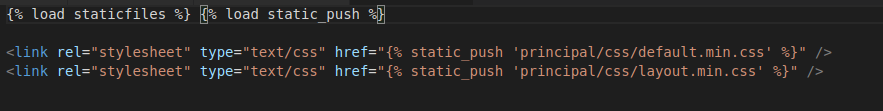

# django_http2_push

[](https://travis-ci.org/ricardochaves/django_http2_push) [](https://coveralls.io/github/ricardochaves/django_http2_push?branch=master) [](https://app.codacy.com/app/ricardochaves/django_http2_push?utm_source=github.com&utm_medium=referral&utm_content=ricardochaves/django_http2_push&utm_campaign=Badge_Grade_Dashboard) [](https://codeclimate.com/github/ricardochaves/django_http2_push/maintainability) 
 [](https://pyup.io/repos/github/ricardochaves/django_http2_push/) [](https://pyup.io/repos/github/ricardochaves/django_http2_push/) [](https://github.com/ambv/black) 
[](https://github.com/ricardochaves/django_http2_push/blob/master/LICENSE) [](https://badge.fury.io/py/django-http2-push) [](https://pepy.tech/project/django-http2-push) [](https://pepy.tech/project/django-http2-push) [](https://pepy.tech/project/django-http2-push) [](https://saythanks.io/to/ricardochaves)


A simple way to add Header LINK

## Install

```bash
pip install django_http2_push
```

Update your `settings.py`

```python
INSTALLED_APPS = [
    ...
    "django_http2_push",
    ...
]

MIDDLEWARE = [
    ...
    "django_http2_push.middleware.PushHttp2Middleware",
    ...
]
```

## Usage

In the templates now use `static_push` instead of `staticfiles`.




